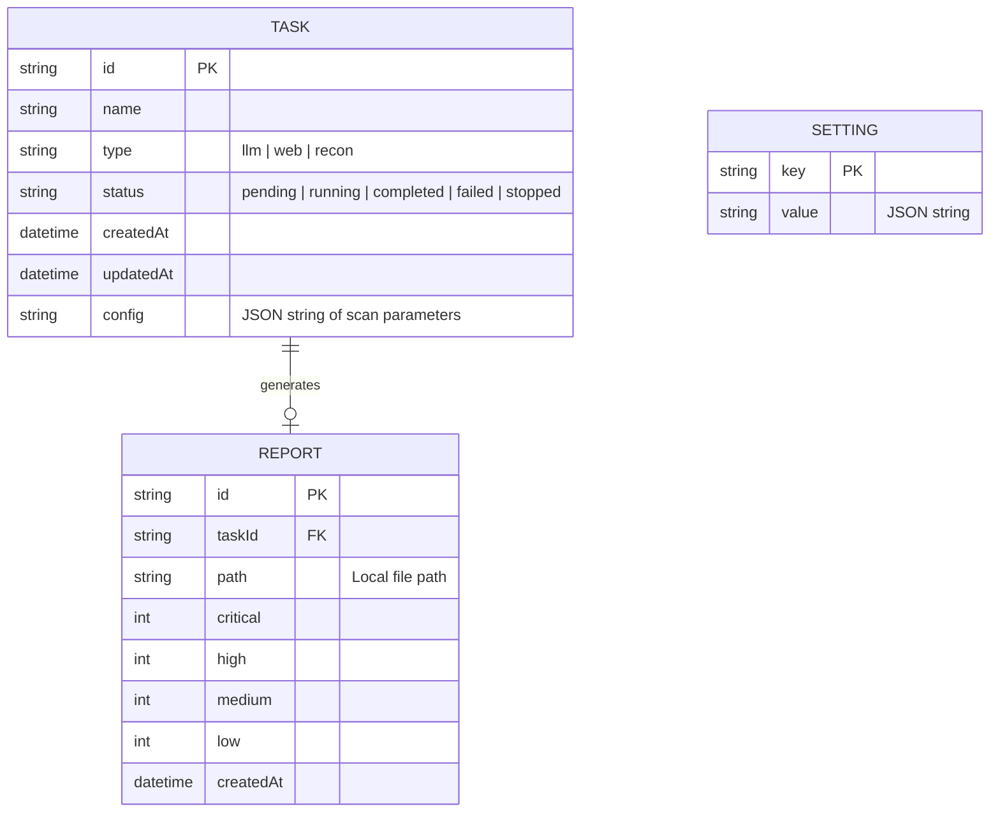

# 技术架构文档 (Technical Architecture)

## 1. 架构设计
```mermaid
graph TD
    subgraph Frontend [Web GUI (Vite + React + TailwindCSS)]
        UI[User Interface]
        State[State Management (Zustand/Context)]
        Charts[Data Visualization (Recharts/ECharts)]
    end
    
    subgraph Backend [Local API Server (Express/Fastify in apps/gui)]
        API[RESTful APIs]
        Runner[Task Runner (exec nullbunny CLI)]
        Monitor[Performance Monitor (os/ps-node)]
        DB[SQLite/JSON for Tasks & Settings]
    end
    
    subgraph NullBunny Core [Core Engine & CLI]
        Core[Packages: core, web, recon, providers]
    end
    
    Frontend -->|HTTP / WebSocket| Backend
    Backend -->|Spawn Child Process / Import Modules| Core
```

## 2. 技术选型
- **前端框架**：React 18 (TypeScript) + Vite 
- **路由管理**：react-router-dom v6
- **UI 组件库**：Tailwind CSS v3 + Radix UI (或 shadcn/ui 组件)
- **图标与图标**：lucide-react, recharts (用于性能指标与统计图表)
- **状态管理**：Zustand
- **数据请求**：axios / swr (或 React Query)
- **后端服务 (GUI Server)**：
  - 新建包 `apps/gui` 存放后端及前端构建产物。
  - 使用 Express (或 Fastify) 提供 REST API 及 WebSocket (实时推送扫描日志与系统性能)。
  - 持久化：轻量级 SQLite (如 `better-sqlite3`) 或纯 JSON 文件存储历史任务与设置。

## 3. 路由定义 (前端)
| 路由 | 目的 |
|------|------|
| `/` | 仪表盘 (Dashboard)，展示概览与性能指标 |
| `/tasks` | 任务中心，列表与新建扫描任务入口 |
| `/tasks/new` | 新建扫描任务向导页 |
| `/tasks/:id` | 任务详情页（含实时日志与进度） |
| `/reports` | 历史报告中心 |
| `/reports/:id` | 单份 SARIF/JSON 报告的可视化详情页 |
| `/marketplace` | Skills 与 MCP 插件市场 |
| `/settings` | 全局设置与 Provider 配置 |

## 4. API 定义 (后端端点)
| API 路径 | 方法 | 功能描述 |
|----------|------|----------|
| `/api/sys/stats` | GET | 获取系统性能指标 (CPU, Memory, 活跃扫描数) |
| `/api/tasks` | GET/POST | 列出所有任务 / 创建新扫描任务 |
| `/api/tasks/:id` | GET/DELETE | 获取任务详情 / 删除任务 |
| `/api/tasks/:id/stop` | POST | 停止运行中的扫描进程 |
| `/api/reports` | GET | 列出本地 `./reports` 目录下的历史报告 |
| `/api/plugins` | GET/POST | 列出/安装/卸载本地的 MCP 和 Skills 插件 |
| `/api/settings` | GET/PUT | 读取/更新全局配置 (Providers 等) |

*注：对于实时日志推送，后端将在 `/ws/tasks/:id` 提供 WebSocket 支持。*

## 5. 后端服务架构图
```mermaid
graph TD
    A[Express Router] --> B[Task Controller]
    A --> C[System Controller]
    B --> D[Task Service]
    C --> E[Monitor Service]
    D --> F[Database (SQLite/JSON)]
    D --> G[Child Process Manager (spawn nullbunny CLI)]
    G --> H[WebSocket Emitter (Logs)]
```

## 6. 数据模型 (Data Model)
### 6.1 实体关系定义


### 6.2 数据库初始化
- 后端服务启动时，检查工作目录（例如 `~/.nullbunny` 或项目根目录下的 `.data` 文件夹），若不存在 SQLite 库则自动执行初始化建表脚本。
- 若采用轻量化路线，直接以 JSON 文件形式保存在 `./.data/tasks.json` 和 `./.data/settings.json` 中，通过 Node.js 的 fs 模块读写。