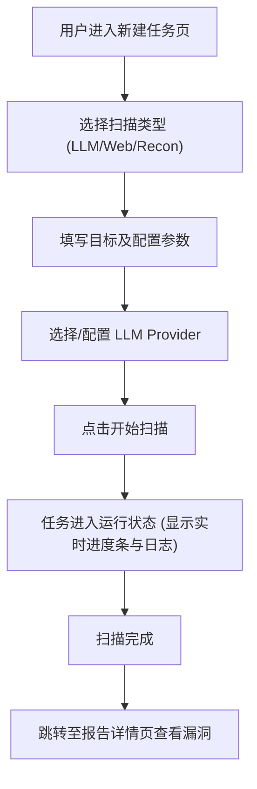

# 产品需求文档 (PRD)

## 1. 产品概述
NullBunny Web GUI 是为 `nullbunny` 命令行工具打造的现代化可视化控制台。
- 旨在为红队人员、安全研究员及开发人员提供直观的操作界面，降低 LLM 和 Web 安全扫描的使用门槛。
- 核心价值：将原本基于 CLI 和 JSON 配置的复杂扫描任务可视化，提供任务进度监控、实时性能指标展示、报告管理以及 MCP/Skills 市场扩展功能，极大提升操作效率与使用体验。

## 2. 核心功能

### 2.1 用户角色
当前为单用户本地运行的控制台工具，不涉及多角色权限管理。
| 角色 | 注册方式 | 核心权限 |
|------|----------|----------|
| 管理员 | 本地免密/Token认证 | 拥有发起扫描、查看报告、安装插件的所有权限 |

### 2.2 功能模块
1. **仪表盘 (Dashboard)**：全局概览、运行状态、性能指标监控。
2. **任务中心 (Tasks)**：创建新扫描任务、实时进度监控、历史任务列表。
3. **报告中心 (Reports)**：扫描结果的可视化分析（漏洞分布、详细 Findings 展示）。
4. **扩展市场 (Marketplace)**：Skills 与 MCP 服务的浏览、安装与状态管理。
5. **设置中心 (Settings)**：LLM Providers 配置、全局扫描参数配置。

### 2.3 页面详情
| 页面名称 | 模块名称 | 功能描述 |
|----------|----------|----------|
| 仪表盘 | 数据概览 | 显示累计扫描次数、发现的高危漏洞数、当前活跃任务数等统计卡片。 |
| 仪表盘 | 性能指标 | 实时图表展示 NullBunny 引擎的内存占用、请求并发数、API 延迟等。 |
| 任务中心 | 新建任务 | 引导式表单（向导），支持配置 LLM 扫描或 Web 漏洞扫描的各项参数。 |
| 任务中心 | 任务看板 | 列表或卡片形式展示历史和运行中任务，提供停止、重试、删除等操作。 |
| 报告中心 | 报告详情 | 针对单次扫描的 Markdown/SARIF 数据进行富文本与图表化渲染。 |
| 扩展市场 | 插件列表 | 展示官方与社区的 Skills/MCP Server，支持一键安装/启用/禁用。 |
| 设置中心 | Provider 配置 | 可视化管理 Ollama、Gemini、Azure 等提供商的 API Key 及 Base URL。 |

## 3. 核心流程
用户通过 GUI 发起一次 LLM 安全扫描的核心流程：

## 4. 用户界面设计

### 4.1 设计风格
- **整体基调**：极客/红队科技风（Dark Mode 优先），专业、克制且充满未来感。
- **主色调**：深邃黑/深空灰（Background），搭配高亮的主题色（如黑客绿 `#00FF00` 或赛博紫 `#B026FF`）。
- **排版与字体**：使用等宽字体（如 `JetBrains Mono` 或 `Fira Code`）展示数据与日志，界面主要字体使用无衬线体（如 `Inter`）。
- **组件风格**：毛玻璃效果（Glassmorphism）、细边框、发光态（Glow effects）按钮。
- **动画与交互**：数字滚动跳动、扫描时的雷达/波纹动画，平滑的路由切换。

### 4.2 页面设计概览
| 页面名称 | 模块名称 | UI 元素 |
|----------|----------|---------|
| 仪表盘 | 全局监控 | 包含渐变折线图（性能）、环形图（漏洞比例）、动态状态指示灯。 |
| 任务中心 | 任务卡片 | 带进度条的卡片，悬浮时显示发光边框，运行中显示脉冲动画。 |
| 报告详情 | 漏洞列表 | 手风琴折叠面板，关键数据使用不同颜色的 Tag（Critical: 红, High: 橙）。 |

### 4.3 响应式设计
- **Desktop First**：专为桌面端宽屏优化，采用侧边栏导航 + 右侧主内容区的经典中后台布局。
- **移动端适配**：侧边栏可折叠为汉堡菜单，数据图表支持横向滚动或堆叠显示。